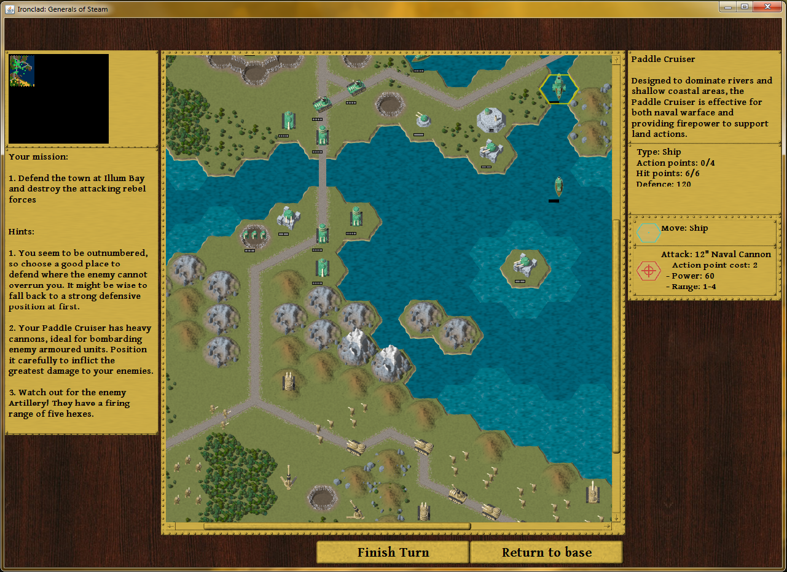
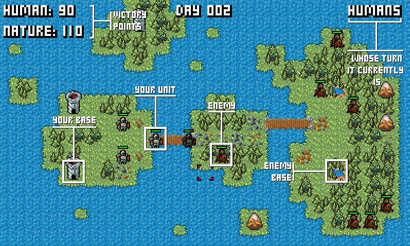
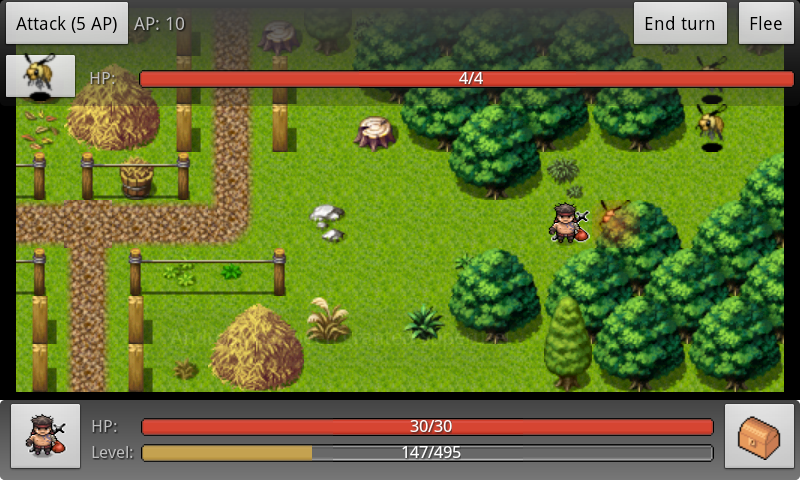
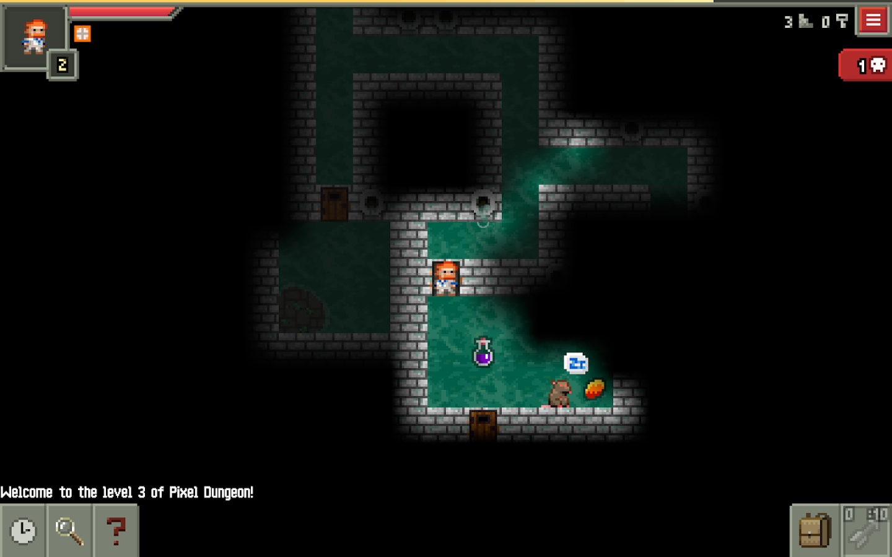

# Open Source Java Games

Simple open source games that are nice and playable.

# Breaking The Tower

Simulation, [video](https://www.youtube.com/watch?v=Dp0qJsWaiX0),
[download](https://github.com/alexeypetrushin/BreakingTheTower), Java.

This game has been created by Markus Persson (creator of Minecraft) in about
two days before he was famous.

# 2D Minecraft

2D Minecraft clone, [video](http://www.youtube.com/watch?v=EwW22P3UnLc),
[about](http://www.ludumdare.com/compo/ludum-dare-22/?action=preview&uid=398),
Java.

Also created by Markus Persson (creator of Minecraft) in about two days
before he was famous.

# Ironclad

Turn Based Strategy, [download](http://mikera.net/ironclad),
[sources](https://github.com/mikera/ironclad), Clojure compiled to Java.

# Nature's Villain

Turn Based Strategy, [play](https://dl.dropbox.com/u/9013021/NaturesVillain/index.html),
[about](http://www.ludumdare.com/compo/ludum-dare-25/?action=preview&uid=5433),
[sources](https://dl.dropbox.com/u/9013021/NaturesVillainSource.zip),
Java & GWT compiled to JavaScript.

# Andor's Trail

Turn Based RPG, [video](http://www.youtube.com/watch?v=kukLxTHzr3w),
[download](http://code.google.com/p/andors-trail),
[sources](http://code.google.com/p/andors-trail), Java. Full game, lots of code,
not a simple one.

# Pixel Dungeon

Roguelike, [video](http://www.youtube.com/watch?v=pcQN5mrnUlM),
[about](https://play.google.com/store/apps/details?id=com.watabou.pixeldungeon),
[sources](https://github.com/watabou/pixel-dungeon), Java & Android. Full game,
lots of code, not a simple one.

- Tags : Games, Clojure, GWT
- Date : 2014/9/17
